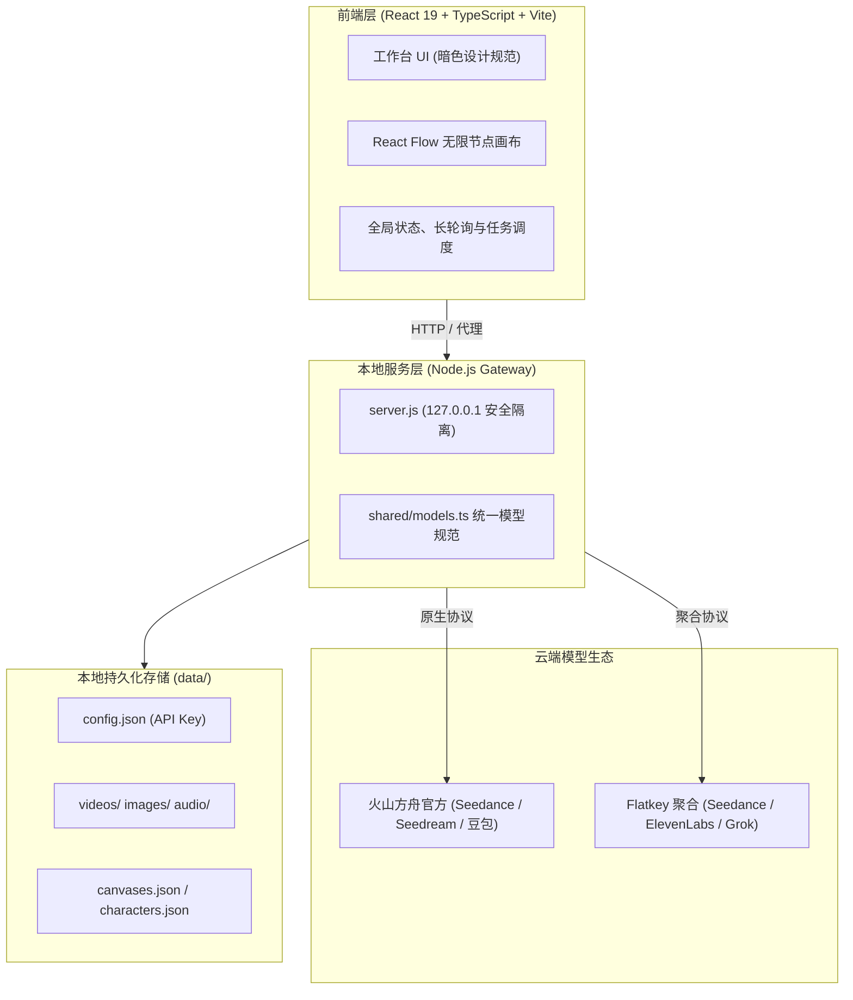

<div align="center">

<p align="center">
  
</p>

### 本地优先的次世代 AIGC 多模态创作工作台
*A local-first, multimodal generative AI workbench powered by Seedance 2.5/2.0, Seedream 5.0, ElevenLabs & Infinite Node Canvas.*

[](LICENSE)
[](https://nodejs.org)
[](https://react.dev)
[](https://vitejs.dev)
[](https://reactflow.dev)

[功能特性](#-功能特性) • [快速开始](#-快速开始) • [双平台支持](#-双平台支持) • [架构与存储](#-系统架构与数据存储) • [开发者指南](#-开发者指南) • [常见问题](#-常见问题)

</div>

---

> **设计理念**：深色工作台美学（深度参考 Google Antigravity 与 OpenAI Codex）。侧栏纯粹导航，居中一体化创作输入框，全局采用低对比层次与系统无衬线排版。界面本身保持克制中性，将所有视觉焦点留给生成内容本身。

---

## 📸 界面预览

<!-- 建议在此放置 1~2 张高分辨率工作台界面截图或 10 秒操作演示 GIF -->
> 💡 *提示：建议在仓库的 `docs/` 或 Release 资源中添加工作台主视图与无限画布节点连线的实机截图。*

---

## ✨ 功能特性

### 1. 🌌 无限节点画布 (Infinite Node Canvas)
- **可视化创意工作流**：基于 `@xyflow/react` 构建无限平移与缩放画布，支持多项目管理、视口记忆与自动保存。
- **全要素自由拓扑**：提供**文本、图片、视频、音频**四种原生节点，支持拖拽连线驱动生成：
  - **文本 ➔ 视频/图片**：传递为生成提示词（Prompt）。
  - **图片 ➔ 视频**：作为全能参考图、首帧（起始画面）或尾帧（结束画面）。
  - **图片 ➔ 图片**：图生图迭代重绘（火山方舟 Seedream）。
  - **视频/音频 ➔ 视频**：作为 Seedance 全能参考素材（动作/镜头/节奏/参考音）。
- **即时创作控制器**：双击空白处快速新建，选中节点即在底部呼出参数控制栏，支持本地文件与素材库直接拖拽入画布。

### 2. 🎥 顶尖多模态矩阵 (Multimodal Matrix)
- **电影级视频生成 (Video)**：
  - **Seedance 2.5 / 2.0 / 2.0 Fast / 2.0 Mini**：支持全能参考（最多 9 张图片、3 段视频与 3 段音频混合输入）、首尾帧控制、视频接续延长、定向编辑重绘、画质超分与联网搜索增强。
  - **Grok Video**：支持文生视频与首帧图生视频（480p / 720p，最长 15 秒）。
- **专业图像生成 (Image)**：
  - **Seedream 5.0 (Pro / Flash / 标准版)**：支持多图融合条件控制（最高支持 14 张参考图图生图）。
  - **Grok Imagine**：文生图与一键转视频首帧流转。
- **全链路声音实验室 (Audio & Music)**：
  - **智能配乐 (Soundtrack Scoring)**：上传任意视频，AI 自动生成与视频时长精确匹配的背景音乐，提供声画同轨试听面板。
  - **自然语音合成 (TTS)**：支持火山豆包语音 2.0（230+ 官方音色库）与 ElevenLabs（多语言筛选与实时音色试听）。
  - **环境音效生成 (SFX)**：依据声音描述与指定秒数生成逼真音效素材。

### 3. 🎭 角色一致性管理 (Consistent Characters)
- 独立的角色档案管理系统，持久化保存角色名称、背景设定及至多 6 张核心概念图。
- 创作时支持一键调用角色，带入图像或视频生成流，解决多镜头创作中的面孔与服饰漂移难题。

### 4. 🧠 提示词技能库与自适应润色 (Skills & Prompt Engine)
- **预设工业级技能 (Skills)**：内置「多镜头成片（视频）」、「角色设定图」、「分镜首帧（图片）」等官方模板，写一句简短意图即可由大模型扩写为专业分镜提示词。
- **模型自适应润色**：根据下游模型规则（Seedance 动态描述规范、Grok 语义理解、ElevenLabs 语音标签）智能重写提示词，支持模型故障自动切换与一键撤销。

### 5. 🔒 本地优先与数据私有化 (Local-First)
- 所有生成的视频、图片、音频及画布配置均**100% 存储于本机**。
- API 凭证保存在本地或仅通过环境变量注入，服务严格监听环回接口（`127.0.0.1`），拒绝跨站请求，保障数据绝对安全。

---

## 🚀 快速开始

### 运行环境
- **Node.js**：`>= 22.18`（推荐下载 [Node.js LTS](https://nodejs.org)）

### 安装与启动

```bash
# 1. 克隆仓库
git clone https://github.com/realruian/seedance-studio.git
cd seedance-studio

# 2. 安装依赖并启动
npm install
npm start
```

构建完成后，在浏览器中打开：**`http://127.0.0.1:5178`**。

> 💡 **提示**：终端进程运行期间服务保持在线。如需指定端口运行：
> ```bash
> PORT=5180 npm start
> ```

第一次启动时，系统会自动打开「设置」窗口，粘贴并保存你的平台 API Key 即可使用。

---

## ⚖️ 双平台支持

Innate Studio 内置双平台驱动，在「设置 ➔ 模型平台」中自由切换，两套 Key 独立保存：

| 功能维度 | 火山方舟 (Volcengine Ark 原生) | Flatkey (聚合网关) |
| :--- | :--- | :--- |
| **视频模型** | Seedance 2.5、2.0、2.0 Fast、2.0 Mini | Seedance 2.0、Grok Video |
| **参考生成** | 全能参考（本地图片/音频）、首尾帧 | 全能参考（素材库模式）、首帧生视频 |
| **视频编辑** | 原生分辨率、画质超分、联网增强 | 视频后续延长、指定内容重绘编辑 |
| **图像生成** | Seedream 5.0 (Pro / Flash / 标准)，支持多参考图 | Grok Imagine |
| **语音合成** | 豆包语音合成 2.0（230+ 官方音色） | ElevenLabs（音色试听与语言筛选） |
| **声音生成** | 规划支持中 | AI 拟真音效 + 视频智能匹配配乐 |
| **Prompt 润色** | 豆包大语言模型 | Claude / GLM / Grok 多模型容灾 |
| **余额查询** | 火山引擎控制台费用中心 | 设置面板内直接查看实时账户余额 |

---

## 🧱 系统架构与数据存储

### 架构全景



### 数据目录规范 (`data/`)

所有应用数据均完全保存在本机的 `data/` 目录下：

| 文件 / 目录 | 内容说明 |
| :--- | :--- |
| `data/config.json` | 本地 API Key 配置（亦可通过环境变量直接注入） |
| `data/history.json` | 历史生成任务及元数据记录 |
| `data/canvases.json` | 画布项目工程数据（节点拓扑、连线关系、视口状态） |
| `data/characters.json` | 角色库档案（名称、设定及参考图关联） |
| `data/skills.json` | 用户自定义的提示词工程技能 |
| `data/videos/` | 生成完成自动保存的高清视频文件 |
| `data/images/` | 生成的图像文件 |
| `data/audio/` | 生成的语音、音效与配乐音频 |
| `data/uploads/` | 用户本地上传作为输入条件的素材文件 |

> 🔑 **无痕模式**：若不想在文件中持久化 Key，也可以通过环境变量启动：
> ```bash
> FLATKEY_API_KEY=sk-fk-... ARK_API_KEY=... DOUBAO_SPEECH_API_KEY=... npm start
> ```

---

## 🛠️ 开发者指南

### 本地调试与开发

```bash
# 启动热更新前端开发环境（默认连接 5178 本地服务）
npm run dev

# 运行自动化测试与类型检查（包含 Mock 全流程接口测试）
npm test

# 启动带 Mock 数据与接口的独立测试环境（端口 5179，无需消耗真实 Token）
npm run dev:mock
```

### 视觉走查与设计规范
本项目遵循严格的界面视觉规范（对标 Antigravity 2.0 与 Codex 工作台）。在修改界面组件或样式前，请务必参阅 **[DESIGN.md](DESIGN.md)**。

---

## 💬 常见问题

<details>
<summary><b>1. 访问境外接口提示网络连接不稳定？</b></summary>

Node.js 默认不会自动接管系统的全局代理。若访问 Flatkey 时出现连接超时或中断，可通过环境代理开关启动：
```bash
NODE_USE_ENV_PROXY=1 npm start
```
服务将自动读取终端配置的 `HTTPS_PROXY` / `HTTP_PROXY` 代理通道。
</details>

<details>
<summary><b>2. 火山方舟开通与计费前置条件</b></summary>

使用火山方舟前，请先在火山引擎控制台完成以下准备：
1. **账户充值**：开通 Seedance 2.0 / 2.5 官方通常要求账户余额大于 200 元；
2. **开通模型**：在火山方舟「开通管理」中激活对应的 Seedance 视频模型与 Seedream 生图模型接入点；
3. **获取 API Key**：创建方舟 API Key 并填入本应用；
4. **豆包语音**：语音合成属于「豆包语音」独立产品，需在豆包语音控制台开通并获取独立的语音 Key。
</details>

<details>
<summary><b>3. 任务超时与离线查询机制</b></summary>

视频生成等长耗时异步任务会由本地服务自动轮询。若网络波动或单任务超过 6 小时未完成，系统会标记为「查询超时」，随时可以在创作记录中点击「再查一次」恢复状态拉取。
</details>

---

## 📄 开源许可与致谢

- 核心代码基于 [MIT 许可证](LICENSE) 开源。
- 图标采用 [Hugeicons](https://hugeicons.com/)（MIT 许可证），详见 [THIRD-PARTY-NOTICES.md](THIRD-PARTY-NOTICES.md)。
